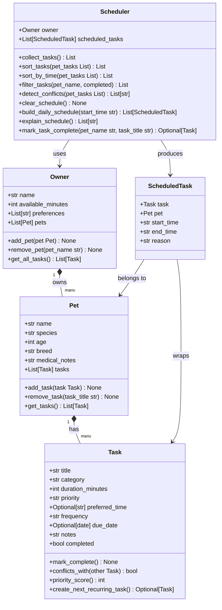

# PawPal+ (Project 2)

This is my Module 2 project — a Streamlit app that helps a pet owner stay on top of their pet care. You can add pets, create tasks for each one, and generate a daily schedule based on your available time and task priorities.

---

## What it does

- Add an owner profile with how many minutes you have free today
- Add pets with basic info (name, species, age, breed, medical notes)
- Add care tasks — feeding, walks, medication, grooming, etc.
- Filter tasks by pet or completion status
- Get warned if two tasks are scheduled at the same time
- Generate a daily schedule that fits your time budget, with a short explanation for each task

---

## How the classes are structured



I have 5 classes total. `Owner` has pets, each `Pet` has tasks, and the `Scheduler` takes the owner and figures out the daily plan. `ScheduledTask` is just a small wrapper that adds start/end times and a reason to each task once it's been scheduled.

---

## How the scheduling works

The scheduler uses a simple greedy approach:

1. Collect all incomplete tasks from all pets
2. Sort them — highest priority first, then earliest preferred time as a tiebreaker
3. Go through the list and add each task to the schedule as long as the total time doesn't go over `available_minutes`
4. Any task that doesn't fit gets skipped

It's not perfect — it won't rearrange tasks to squeeze in more — but it's predictable and handles the most important tasks first, which is the point.

Conflict detection is separate. It just checks if any two tasks have the exact same preferred time and warns you if they do.

---

## Tests

I wrote 6 tests covering the main behaviors:

| Test | What it checks |
|------|---------------|
| `test_mark_complete_changes_status` | Marking a task done flips `completed` to `True` |
| `test_add_task_to_pet` | Adding a task to a pet saves it correctly |
| `test_sort_by_time_returns_chronological_order` | Tasks sort by time regardless of insertion order |
| `test_daily_task_completion_creates_next_recurring_task` | Completing a daily task creates the next one with tomorrow's date |
| `test_conflict_detection_flags_duplicate_times` | Two tasks at the same time produce one conflict warning |
| `test_pet_with_no_tasks_returns_empty_list` | No tasks means an empty schedule |

```bash
pytest tests/
```

---

## Setup

```bash
python -m venv .venv
source .venv/bin/activate    # Windows: .venv\Scripts\activate
pip install -r requirements.txt
streamlit run app.py
```
