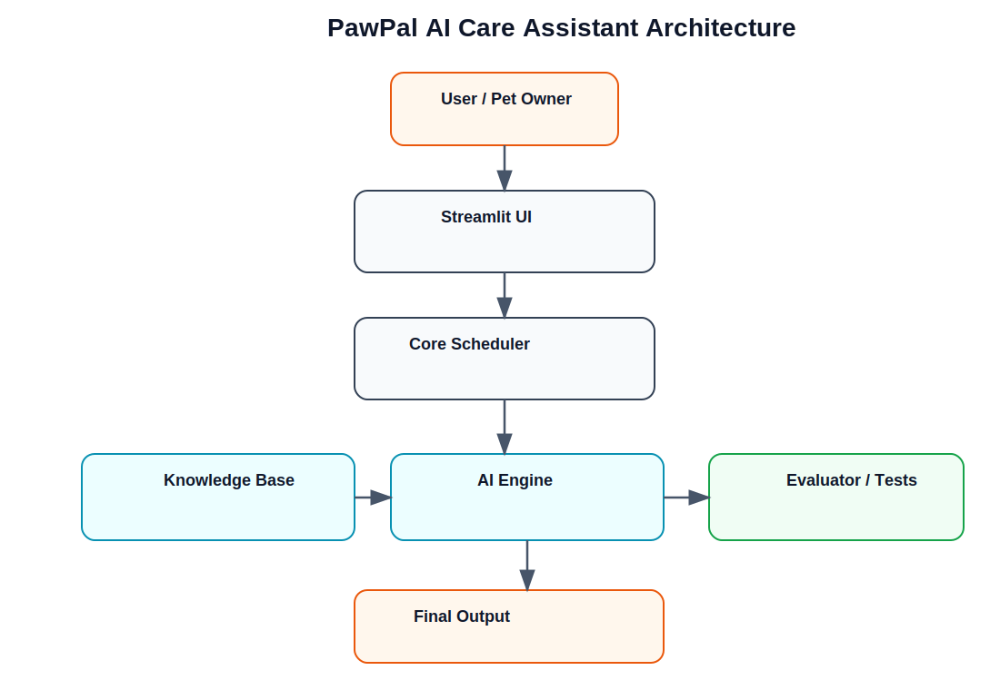

# 🐾 PawPal AI Care Assistant

## 📌 Project Summary
PawPal AI Care Assistant is an intelligent pet-care scheduling system that helps pet owners organize daily tasks while ensuring safety and efficiency. It extends a rule-based scheduler by integrating AI-driven reasoning and retrieval to provide smart suggestions and warnings. This system improves decision-making by combining structured scheduling with AI insights based on real pet-care guidelines.

---

## 🔙 Original Project (Module 2)
This project is an extension of my earlier project **PawPal+**, a Streamlit-based pet-care scheduler. The original system allowed users to add pets, assign tasks (feeding, walking, medication, etc.), and generate a daily schedule based on task priority and available time. It also included features like conflict detection and task filtering.

---

## 🤖 What This Version Adds (Applied AI System)

This version enhances PawPal+ with AI capabilities:

- Retrieval-Augmented reasoning (RAG) using a pet-care knowledge base  
- AI-generated suggestions and safety warnings  
- Improved decision-making with explainable outputs  
- Integration of AI directly into the scheduling workflow  

---

## 🏗️ System Architecture



### Overview
The system is composed of:

- **Streamlit UI (`app.py`)** → handles user input and output  
- **Scheduler (`pawpal_system.py`)** → generates the base schedule  
- **AI Engine (`ai/ai_engine.py`)** → analyzes the schedule and generates suggestions  
- **Knowledge Base (`ai/knowledge/pet_care.txt`)** → provides pet-care rules  
- **Testing/Evaluation** → ensures reliability  

### Data Flow
User Input → Scheduler → AI Analysis → Suggestions → Final Output  

### Human + Testing Role
- The user reviews AI suggestions before acting  
- Testing ensures outputs are consistent and safe  

---

## Reliability and Evaluation

To verify that the AI system works correctly, I implemented an evaluation script (`evaluate_ai.py`) that tests the system on predefined scenarios.

### Results
- 3 out of 3 tests passed
- The AI correctly identified unsafe scheduling patterns such as:
  - Walking immediately after feeding
  - Closely spaced medication tasks
- The AI avoided producing unnecessary warnings for safe schedules

### Conclusion
The system behaved reliably on the tested examples. While the AI is rule-based, it consistently produces correct and explainable outputs. Future improvements could include more advanced reasoning and additional validation rules.

---

## ⚙️ Setup Instructions

```bash
git clone https://github.com/coderG13/applied-ai-pawpal-system.git
cd applied-ai-pawpal-system

python -m venv .venv
source .venv/bin/activate

pip install -r requirements.txt
streamlit run app.py